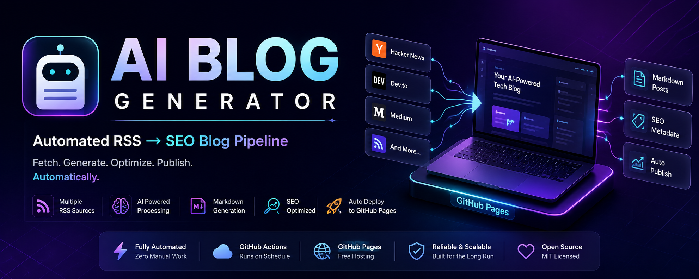

# 🚀 AI Blog Generator

<div align="center">



# 🧠 Automated RSS → SEO Blog Pipeline

### Fully Automated • GitHub Actions Powered • GitHub Pages Hosted

Generate, process, index, and publish technology articles automatically using RSS feeds, Python, GitHub Actions, and a modern glassmorphic website.

<br>


### ⚡ Zero Servers • Zero Hosting Cost • Zero Manual Publishing

</div>

---

# 📖 Overview

AI Blog Generator is a production-ready automated publishing platform that continuously discovers articles from popular developer communities, transforms them into structured content, generates SEO metadata, builds searchable indexes, and deploys a modern blog automatically through GitHub Pages.

The entire platform runs inside GitHub Actions and requires no VPS, no cloud server, no database, and no local execution after setup.

---

# ✨ Key Features

## 📰 RSS Aggregation

Automatically collects content from:

- Hacker News
- Dev.to Python
- Dev.to Web Development
- Dev.to Artificial Intelligence
- Medium Programming
- Medium JavaScript

---

## ⚙️ Content Processing Engine

- RSS Parsing
- HTML Cleaning
- Content Extraction
- Slug Generation
- Metadata Creation
- Markdown Generation
- JSON Index Building

---

## 🔍 SEO Optimization

Automatically generates:

- SEO Descriptions
- Search Keywords
- Clean URLs
- Metadata Objects
- Structured Content

---

## 🎨 Modern Glassmorphic Frontend

Features:

- Glassmorphism Design
- Responsive Layout
- Mobile First UI
- Search Interface
- Dynamic Post Loading
- Smooth Animations
- Modern Typography
- Category Ready Structure

---

## 🤖 Full Automation

Powered entirely by:

- GitHub Actions
- Scheduled Workflows
- GitHub Pages Deployment
- Automated Content Generation
- Automatic Site Updates

---

# 🏗️ System Architecture

```text
RSS Sources
│
├── Hacker News
├── Dev.to
└── Medium
      │
      ▼
RSS Aggregator
      │
      ▼
Article Extractor
      │
      ▼
Content Cleaner
      │
      ▼
SEO Processor
      │
      ▼
Markdown Generator
      │
      ▼
Post Index Builder
      │
      ▼
Website Data Layer
      │
      ▼
GitHub Pages
```

---

# 📂 Repository Structure

```text
AI-Blog-Generator/
│
├── .github/
│   └── workflows/
│       └── deploy.yml
│
├── config/
│   └── feeds.yml
│
├── posts/
│   └── generated/
│
├── scripts/
│   └── generate.py
│
├── src/
│   ├── rss/
│   ├── parser/
│   ├── seo/
│   ├── generator/
│   └── utils/
│
├── website/
│   ├── css/
│   ├── js/
│   ├── data/
│   └── index.html
│
└── README.md
```

---

# 🔄 Automated Workflow

```text
Schedule Trigger
       │
       ▼
Fetch RSS Feeds
       │
       ▼
Extract Articles
       │
       ▼
Clean Content
       │
       ▼
Generate Metadata
       │
       ▼
Create Markdown Files
       │
       ▼
Build posts.json
       │
       ▼
Deploy Website
       │
       ▼
GitHub Pages
```

---

# 📦 Generated Assets

The system automatically creates:

```text
posts/generated/*.md
website/data/raw_articles.json
website/data/posts.json
```

---

# 🛠️ Technology Stack

| Layer | Technology |
|---------|------------|
| Language | Python 3.11 |
| Automation | GitHub Actions |
| Hosting | GitHub Pages |
| Frontend | HTML |
| Styling | CSS |
| Interactivity | JavaScript |
| Data Format | JSON |
| Content Format | Markdown |
| Feed Source | RSS |

---

# 📈 Project Progress

## ✅ Phase 1 — Foundation

Completed:

- Project Structure
- Feed Configuration
- RSS Infrastructure
- Utility Modules

---

## ✅ Phase 2 — Content Engine

Completed:

- RSS Fetching
- Feed Aggregation
- Content Extraction
- HTML Cleaning

---

## ✅ Phase 3 — SEO Layer

Completed:

- Keyword Generation
- SEO Descriptions
- Metadata Creation
- Slug Generation

---

## ✅ Phase 4 — Modern Website

Completed:

- Glassmorphic UI
- Responsive Design
- Search Functionality
- Dynamic Content Loading
- Professional Layout

---

## ✅ Phase 5 — Automation

Completed:

- GitHub Actions Workflow
- Scheduled Execution
- Auto Deployment
- GitHub Pages Publishing

---

# 🚀 Deployment Model

Everything runs on GitHub.

```text
GitHub Actions
      │
      ▼
Python Pipeline
      │
      ▼
Website Build
      │
      ▼
GitHub Pages
```

No:

- VPS
- AWS
- Azure
- DigitalOcean
- Docker Server

Required.

---

# ⏰ Scheduled Updates

Example Workflow:

```yaml
cron: "0 */6 * * *"
```

This executes the pipeline every 6 hours and publishes fresh content automatically.

---

# 🎯 Current Capabilities

- Automated RSS Monitoring
- Automatic Content Collection
- Markdown Generation
- SEO Metadata Creation
- Searchable Frontend
- Automatic Deployment
- GitHub Pages Hosting
- Zero-Cost Operation

---

# 🔮 Phase 6 Roadmap

Planned Improvements:

- Duplicate Detection
- Archive Pages
- Trending Posts
- Pagination
- Categories
- Tags
- Sitemap.xml
- robots.txt
- Open Graph Images
- Advanced SEO
- Analytics Dashboard

---

# 🤝 Contributing

Contributions are welcome.

Ideas, bug reports, feature requests, and pull requests help improve the project.

---

# 📄 License

Released under the MIT License.

You are free to use, modify, distribute, and build upon this project.

---

<div align="center">

## ⭐ Support The Project

If this project helped you, consider starring the repository.

### Built with Python, GitHub Actions, and GitHub Pages

</div>
